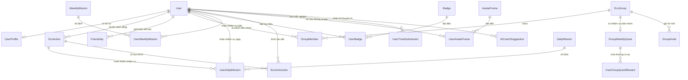

# HỌC VIỆN CÔNG NGHỆ SÁNG TẠO TEKY
## LẬP TRÌNH WEB DJANGO – PATHWAY

<br>
<br>

<div align="center">

# BÁO CÁO THỰC TẬP

## HÀNH TRÌNH LÀM THỰC TẬP SINH DEV/WEB

<br>
<br>

**GVHD:** LÊ THANH NHÀN  
**SVTH:** TĂNG HOÀNG MINH HUY  
**MSHS:** HCM-CH-002318  
**LỚP:** TE-C-PA-1518-2023LTWD-0015  

<br>
<br>
<br>
<br>

### TP. HỒ CHÍ MINH – NĂM 2026

</div>

---
pagebreak
---

### LỜI CẢM ƠN

Em xin gửi lời cảm ơn chân thành và sâu sắc đến thầy **Nguyễn Minh Cường** – người đã tận tình hướng dẫn, theo dõi và hỗ trợ em trong suốt quá trình thực tập tại vị trí Dev/Web. Sự tận tâm và thân thiện của thầy đã giúp em cảm thấy mình luôn được đồng hành và dẫn dắt đúng hướng, ngay cả khi gặp khó khăn hay bỡ ngỡ trong những ngày đầu thực tập.

Em cũng xin được gửi lời cảm ơn đặc biệt đến thầy **Lê Thanh Nhàn** – giáo viên chính phụ trách lớp học. Trong suốt quá trình làm việc cùng thầy, em đã học hỏi được rất nhiều từ phong cách giảng dạy linh hoạt, cách truyền đạt kiến thức một cách sinh động và gần gũi với học sinh, cũng như sự kiên nhẫn và tận tâm của thầy. Nhờ sự chỉ dẫn và hỗ trợ của thầy, em đã có thể hoàn thành tốt nhiệm vụ của mình.

Kỳ thực tập hè không chỉ là một đợt thực tập, mà thực sự là một hành trình trải nghiệm và trưởng thành. Em đã có một mùa hè đáng nhớ – nơi em được học, được làm và được lớn lên trong chính môi trường đầy cảm hứng và nhân văn này.

Một lần nữa, em xin chân thành cảm ơn thầy Nguyễn Minh Cường, thầy Lê Thanh Nhàn đã tạo điều kiện tuyệt vời để em có được những trải nghiệm thực tế đầy ý nghĩa.

<div align="right">

*TP. Hồ Chí Minh, Ngày 12 tháng 6 năm 2026*  
**Học sinh thực hiện**  
*(Ký và ghi rõ họ tên)*  
<br>
<br>
**Tăng Hoàng Minh Huy**

</div>

---
pagebreak
---

### NHẬN XÉT CỦA ĐƠN VỊ THỰC TẬP
*(Đánh giá tính xác thực về các dữ liệu, số liệu và mức độ đạt yêu cầu của báo cáo thực tập)*

* **Mức độ đánh giá:**
  - [ ] Xuất sắc
  - [ ] Tốt
  - [ ] Khá
  - [ ] Đáp ứng yêu cầu
  - [ ] Không đáp ứng yêu cầu

* **Nhận xét thêm:**
  $$\dots\dots\dots\dots\dots\dots\dots\dots\dots\dots\dots\dots\dots\dots\dots\dots\dots\dots\dots\dots\dots\dots\dots\dots\dots\dots\dots\dots\dots\dots\dots\dots\dots\dots\dots\dots\dots\dots\dots\dots\dots\dots\dots\dots\dots\dots\dots\dots$$
  $$\dots\dots\dots\dots\dots\dots\dots\dots\dots\dots\dots\dots\dots\dots\dots\dots\dots\dots\dots\dots\dots\dots\dots\dots\dots\dots\dots\dots\dots\dots\dots\dots\dots\dots\dots\dots\dots\dots\dots\dots\dots\dots\dots\dots\dots\dots\dots\dots$$
  $$\dots\dots\dots\dots\dots\dots\dots\dots\dots\dots\dots\dots\dots\dots\dots\dots\dots\dots\dots\dots\dots\dots\dots\dots\dots\dots\dots\dots\dots\dots\dots\dots\dots\dots\dots\dots\dots\dots\dots\dots\dots\dots\dots\dots\dots\dots\dots\dots$$

<br>
<br>

<div align="center">

### XÁC NHẬN CỦA ĐƠN VỊ THỰC TẬP

</div>

| Giáo viên hướng dẫn | Đại diện đơn vị | Đơn vị |
| :---: | :---: | :---: |
| *(Ký, ghi rõ họ tên, đóng dấu)* | *(Ký, ghi rõ họ tên, đóng dấu)* | *(Ký, ghi rõ họ tên, đóng dấu)* |
| | | |
| | | |
| | | |

---
pagebreak
---

### MỤC LỤC

* [LỜI CẢM ƠN](#lời-cảm-ơn)
* [NHẬN XÉT VÀ XÁC NHẬN CỦA ĐƠN VỊ THỰC TẬP](#nhận-xét-của-đơn-vị-thực-tập)
* [MỤC LỤC](#mục-lục)
* [LỜI MỞ ĐẦU](#lời-mở-đầu)
* [CHƯƠNG 1: TỔNG QUAN VỀ HỌC VIỆN CÔNG NGHỆ SÁNG TẠO TEKY](#chương-1-tổng-quan-về-học-viện-công-nghệ-sáng-tạo-teky)
  - [1. Quá trình hình thành và phát triển](#1-quá-trình-hình-thành-và-phát-triển-của-học-viện-sáng-tạo-công-nghệ-teky)
  - [2. Sứ mệnh và Tầm nhìn](#2-sứ-mệnh-và-tầm-nhìn)
  - [Tổng kết Chương 1](#tổng-kết-chương-1)
* [CHƯƠNG 2: THỰC TẬP VÌ TRÍ DEV/WEB - KỲ 1 (01/06 - 12/06)](#chương-2-thực-tập-vị-trí-devweb-tại-teky)
  - [Phần 1: Kiến thức được học](#phần-1-kiến-thức-được-học)
  - [Phần 2: Dự án thực hiện (Eco Tracker & Sa bàn mô phỏng)](#phần-2-dự-án-thực-hiện-eco-tracker)
  - [Phần 3: AWS (Triển khai hệ thống trên Amazon Web Services)](#phần-3-aws-triển-khai-hệ-thống-trên-amazon-web-services)
  - [Tổng kết Chương 2](#tổng-kết-chương-2)
* [KẾT LUẬN](#kết-luận)
* [TÀI LIỆU THAM KHẢO](#tài-liệu-tham-khảo)

---
pagebreak
---

### LỜI MỞ ĐẦU

Trong bối cảnh công nghệ thông tin phát triển mạnh mẽ và quá trình chuyển đổi số đang diễn ra trên nhiều lĩnh vực, nhu cầu về các sản phẩm và dịch vụ công nghệ ngày càng gia tăng. Đặc biệt, phát triển website và các nền tảng trực tuyến đã trở thành một phần quan trọng trong hoạt động của doanh nghiệp, góp phần nâng cao hiệu quả quản lý, quảng bá thương hiệu và cải thiện trải nghiệm người dùng. Vì vậy, việc trang bị kiến thức chuyên môn cũng như tiếp cận với môi trường làm việc thực tế là yêu cầu cần thiết đối với sinh viên ngành Công nghệ thông tin.

Thực tập doanh nghiệp là cơ hội để sinh viên vận dụng những kiến thức đã học vào thực tiễn, đồng thời học hỏi thêm kinh nghiệm làm việc, kỹ năng chuyên môn và tác phong nghề nghiệp. Trong thời gian thực tập tại Công ty Cổ phần Công nghệ và Sáng tạo Trẻ (Teky), em đã có cơ hội tìm hiểu về môi trường làm việc chuyên nghiệp, tham gia vào các công việc liên quan đến phát triển web và tiếp cận với những công nghệ, công cụ được sử dụng trong thực tế.

Báo cáo thực tập này được thực hiện nhằm tổng kết những kiến thức, kỹ năng và kinh nghiệm mà em đã tích lũy được trong quá trình thực tập tại công ty. Nội dung báo cáo tập trung trình bày quá trình tìm hiểu công việc, các nhiệm vụ được giao, kết quả đạt được cũng như những bài học kinh nghiệm rút ra trong thời gian thực tập. Thông qua đó, em có cơ hội đánh giá lại năng lực bản thân, đồng thời định hướng rõ hơn cho quá trình học tập và phát triển nghề nghiệp trong tương lai.

---
pagebreak
---

### CHƯƠNG 1: TỔNG QUAN VỀ HỌC VIỆN CÔNG NGHỆ SÁNG TẠO TEKY

#### 1. Quá trình hình thành và phát triển của Học viện Sáng tạo Công nghệ TEKY

##### 1.1 Quá trình hình thành
Học viện Sáng tạo Công nghệ Teky được thành lập vào tháng 6/2016, với tầm nhìn tiên phong mang giáo dục STEAM (Khoa học – Công nghệ – Kỹ thuật – Nghệ thuật – Toán học) chuẩn Mỹ đến Việt Nam, dành cho trẻ em từ 4 đến 18 tuổi. Dưới đây là hành trình hình thành và những cột mốc quan trọng của Teky:
* Teky chính thức ra đời vào tháng 6/2016, trở thành học viện đầu tiên tại Việt Nam áp dụng phương pháp giáo dục STEAM chuẩn Mỹ.
* Tập trung vào các bộ môn công nghệ tiên tiến như Lập trình và Phát triển ứng dụng, Robotics Engineering, Công nghệ 3D, và Truyền thông đa phương tiện.
* Xây dựng nền tảng học tập kết hợp Online và Offline, sử dụng hệ thống LMS tích hợp A.I để cá nhân hóa lộ trình học, cùng đội ngũ giáo viên giàu kinh nghiệm, tận tâm.

##### 1.2 Sự phát triển và thành tựu
* **Tháng 11/2016:** Chỉ 5 tháng sau khi thành lập, học viện Teky giành 5 huy chương bạc tại cuộc thi lập trình quốc tế WeCode (bộ môn Scratch, độ tuổi 6-9), khẳng định chất lượng đào tạo vượt trội.
* **Tháng 3/2017:** Được Chính phủ Úc bình chọn là 1 trong 10 dự án Ảnh hưởng Xã hội hàng đầu Đông Nam Á, và là dự án duy nhất của Việt Nam trong số 2.000 dự án được sàng lọc.
* **Tháng 6/2017:** Lọt top 3 dự án xuất sắc tại sự kiện Women NextGen Entrepreneur tại Thụy Sĩ, ghi dấu ấn trên trường quốc tế.
* **Tháng 9/2017:** Triển khai chương trình Hour of Code, tiếp cận hơn 3.000 học sinh trên toàn quốc, truyền cảm hứng học công nghệ.
* **2017-2019:** Nhận 5 giải thưởng Rice Bowl Startup Award bao gồm:
  - *2017:* Dự án đào tạo có ảnh hưởng xã hội tốt nhất.
  - *2018:* Khởi nghiệp được bình chọn nhiều nhất & Dự án cống hiến cho xã hội tốt nhất.
  - *2019:* Founder Of The Year & Best NewComer.
* **2019:** Vinh danh tại Giải thưởng Doanh nghiệp Đông Nam Á (ABA). Đồng thời, bà Đào Lan Hương nhận giải Doanh nghiệp khởi nghiệp và đổi mới sáng tạo xuất sắc tại ASEAN BIS. Ông Lê Quang Tuấn được vinh danh Nhà lãnh đạo Giáo dục công nghệ Xuất sắc nhất Châu Á tại Singapore.
* **Tháng 12/2019:** Teky được Diễn đàn Kinh tế Thế giới (WEF) công nhận là mô hình giáo dục toàn cầu tiêu biểu tại Davos, Thụy Sĩ, khẳng định vị thế trên trường quốc tế.
* **2020:** 
  - *Giải thưởng Quốc tế Stevie Awards:* Vinh danh tại hạng mục Stevie Awards for Women in Business nhờ những nỗ lực thúc đẩy công nghệ và kinh doanh giáo dục.
  - *Đề cử Giải thưởng Startup Toàn cầu (Global Startup Awards):* Đại diện duy nhất của Việt Nam tranh tài ở vòng quốc tế.
* **2023:** 
  - *Giải thưởng Công nghệ Giáo dục tiêu biểu:* Nhận cúp vinh danh tại lễ trao giải EdTech Awards 2023.
  - *Top 50 EdTech Đông Nam Á:* Năm đầu tiên được tổ chức xếp hạng giáo dục toàn cầu HolonIQ ghi danh vào danh sách.
* **2024:** 
  - *Nền tảng EdTech Tiêu biểu:* Được vinh danh tại sự kiện EdTech Expo 2024 cho lĩnh vực giáo dục STEM tại Việt Nam.
  - *Top 50 EdTech Đông Nam Á:* Duy trì vị thế năm thứ hai liên tiếp trong bảng xếp hạng uy tín của HolonIQ.
* **2025:** *Top 50 EdTech Đông Nam Á (Năm thứ 3 liên tiếp):* Khẳng định chiến lược bền vững và vị thế dẫn đầu thị trường EdTech Việt Nam.

#### 2. Sứ mệnh và Tầm nhìn

##### 2.1 Sứ mệnh của Teky
Tại TEKY, chúng tôi nuôi dưỡng một thế hệ trẻ Việt Nam bản lĩnh, sáng tạo và làm chủ công nghệ. Với môi trường đào tạo hiện đại, định hướng tương lai và nền tảng STEAM vững chắc, TEKY trang bị cho học sinh tư duy số và kỹ năng máy tính, sẵn sàng dẫn đầu trong kỷ nguyên công nghệ 4.0.

Chúng tôi cam kết lan tỏa giáo dục STEAM tới cộng đồng trẻ, nâng tầm chất lượng học tập tại Việt Nam và khu vực Đông Nam Á. TEKY không ngừng đổi mới, góp phần xây dựng hệ sinh thái giáo dục bắt kịp xu hướng toàn cầu.

Quan trọng hơn, TEKY là nơi truyền cảm hứng – khơi dậy đam mê, đánh thức tiềm năng và nuôi dưỡng tinh thần sáng tạo để các em tự tin bước ra thế giới, trở thành doanh nhân công nghệ và công dân toàn cầu.

##### 2.2 Tầm nhìn trong tương lai
TEKY được khởi nguồn từ khát vọng xây dựng một nền giáo dục công nghệ hiện đại, nơi thế hệ trẻ Việt Nam được nuôi dưỡng tư duy số, phát triển toàn diện và sẵn sàng bước vào kỷ nguyên số với sự tự tin và sáng tạo.

Mục tiêu của chúng tôi hướng đến việc trang bị cho trẻ em Việt Nam nền tảng vững chắc để trở thành những công dân toàn cầu, làm chủ công nghệ và tiên phong trong nền kinh tế số của tương lai.

#### Tổng Kết Chương 1
Học viện Teky là nơi khởi nguồn cho đam mê công nghệ của các bạn nhỏ từ 5 đến 18 tuổi, nơi các em được tiếp cận với mô hình giáo dục STEAM chuẩn Mỹ trong môi trường sáng tạo, hiện đại và đầy cảm hứng. Với triết lý giáo dục hướng đến phát triển toàn diện, Teky không chỉ truyền đạt kiến thức mà còn khơi dậy tư duy phản biện, khả năng sáng tạo và bản lĩnh cá nhân trong mỗi học sinh.

Sự kết hợp giữa chương trình đào tạo chuẩn quốc tế, nền tảng công nghệ tiên tiến cùng đội ngũ giáo viên tận tâm đã tạo nên một hành trình học tập lý tưởng, nơi mà mỗi giờ học đều trở nên sinh động và đầy hứng khởi. Teky mang đến không gian học tập linh hoạt, kết nối học sinh mọi lúc, mọi nơi, phá bỏ ranh giới giữa học trực tuyến và trực tiếp.

Tại Teky, các em không chỉ học về lập trình, robotics, 3D hay truyền thông đa phương tiện, mà còn rèn luyện các kỹ năng mềm quan trọng như thuyết trình, làm việc nhóm và quản lý cảm xúc – những hành trang cần thiết để tự tin bước vào tương lai. TEKY không chỉ là một học viện, mà còn là người bạn đồng hành, là nơi khơi dậy và nuôi dưỡng tiềm năng của thế hệ trẻ Việt Nam.

---
pagebreak
---

### CHƯƠNG 2: THỰC TẬP VỊ TRÍ DEV/WEB TẠI TEKY

Trong kỳ thực tập tại vị trí Dev/Web từ ngày 01/06 đến ngày 12/06 năm 2026, em đã được tiếp cận trực tiếp với quy trình làm việc trong doanh nghiệp công nghệ, học hỏi các kiến thức chuyên môn và tham gia xây dựng các dự án cụ thể. Dưới đây là nội dung chi tiết quá trình thực tập của em:

#### Phần 1: Kiến thức được học

Trong suốt quá trình thực tập, em đã được hướng dẫn và tự tích lũy được nhiều mảng kiến thức công nghệ hiện đại, bao gồm:

1. **Tổng quan loại hình ứng dụng Web:**
   * **Asset Web:** Hệ thống lưu trữ, phân loại và quản lý các tài nguyên đa phương tiện (hình ảnh, mô hình 3D, icon...).
   * **Quiz Web:** Ứng dụng web kiểm tra trắc nghiệm tương tác thời gian thực phục vụ nâng cao kiến thức người dùng.
   * **Portfolio Web:** Trang web cá nhân dùng để giới thiệu bản thân, kỹ năng và trưng bày các sản phẩm/dự án đã thực hiện.

2. **Quy trình Quản lý mã nguồn (Version Control System):**
   * Sử dụng thành thạo **Git** và nền tảng **GitHub** để làm việc nhóm.
   * Học cách khởi tạo kho lưu trữ (Repository), tạo các nhánh phát triển độc lập (branching), thực hiện cập nhật mã nguồn (commit, push), tạo yêu cầu tích hợp mã nguồn (Pull Request) và xử lý xung đột code (conflict resolution).

3. **Thiết kế UI/UX & Phát triển giao diện phía Client (Frontend):**
   * Sử dụng công cụ **Figma** để phân tích, phác thảo Wireframe và thiết kế giao diện UI/UX trực quan cho người dùng.
   * Xây dựng cấu trúc layout trang web bằng **HTML5** và tối ưu hóa thẩm mỹ bằng **CSS3 thuần (Vanilla CSS)**.
   * Triển khai kỹ thuật **Responsive Web Design** để đảm bảo giao diện thích nghi tốt với các kích thước màn hình khác nhau (Desktop, Tablet, Mobile).
   * Tạo hiệu ứng sinh động với các thư viện CSS Animation và thiết kế các thành phần giao diện theo phong cách **Glassmorphism** sang trọng.
   * Sử dụng **JavaScript (ES6)** để tăng tương tác động cho trang web (bật/mở sidebar, quản lý các pop-up, chuyển đổi giao diện sáng/tối - Light/Dark Mode).

4. **Kỹ thuật xử lý dữ liệu và mô phỏng:**
   * Hiểu cấu trúc định dạng dữ liệu **JSON** để truyền nhận thông tin giữa máy khách và máy chủ.
   * Học quy trình xuất dữ liệu và tối ưu hóa tài nguyên thông qua việc chuyển đổi định dạng ảnh đại diện mô hình từ file 3D nặng `.glb` sang ảnh phẳng `.png` giúp hệ thống quản lý tài nguyên tải nhanh hơn và mượt mà hơn.

5. **Lập trình Backend & Kiến trúc hệ thống:**
   * Nắm vững kiến trúc phát triển ứng dụng web theo mô hình **MVT (Model - View - Template)** của **Django Framework** (phiên bản Django 5+ và cấu trúc Django 6.0.6).
   * Sử dụng **Django ORM** để xây dựng, thiết kế sơ đồ cơ sở dữ liệu quan hệ (20 bảng cơ sở dữ liệu liên kết chặt chẽ) và truy vấn dữ liệu hiệu quả.
   * Sử dụng thư viện **Celery** kết hợp với **Redis** để thiết lập hàng đợi tác vụ ngầm bất đồng bộ (Asynchronous Background Tasks), giải quyết các tác vụ tính toán nặng và gọi API bên ngoài mà không gây tắc nghẽn giao diện.
   * Kết nối và gọi các mô hình ngôn ngữ lớn thông qua **Google Gemini API** (Gemini 2.5 Flash) để thực hiện các chức năng kiểm duyệt, phân loại tự động và tư vấn thông minh.

---

#### Phần 2: Dự án thực hiện (Eco Tracker)

Trong thời gian thực tập, em đã áp dụng các kiến thức đã học vào hai dự án thực tế:

##### A. Dự án Sa bàn mô phỏng WRO (Giai đoạn đầu)
* **Nhiệm vụ:** Tìm hiểu, đánh giá các sa bàn mô phỏng phục vụ cho dự án giáo dục. Kiểm tra tính đầy đủ của thông tin, hình ảnh minh họa trên hệ thống.
* **Thực hiện:** Chọn sa bàn thuộc chủ đề WRO (World Robot Olympiad) để triển khai. Tiến hành thiết kế bản đồ, hoàn thiện dữ liệu JSON của sa bàn, chuyển đổi toàn bộ ảnh đại diện mô hình từ định dạng gốc `.glb` sang `.png` để tăng hiệu năng hiển thị trên web. Tiến hành đồng bộ dữ liệu lên hệ thống và đẩy dự án lên GitHub để quản lý phiên bản.

##### B. Dự án Eco Tracker – Nền tảng sống xanh (Giai đoạn tiếp theo)
Dự án lớn xuyên suốt kỳ thực tập của em là **Eco Tracker** – một nền tảng mạng xã hội kết hợp tính năng trò chơi hóa nhằm mục đích bảo vệ môi trường.

###### 1. Giới thiệu chung
* **Tên dự án:** Eco Tracker – Gamified Social Platform for Sustainable Living
* **Mục tiêu:** Eco Tracker là một ứng dụng mạng xã hội kết hợp giữa cơ chế trò chơi hóa (Gamification), Trí tuệ nhân tạo (AI) và mạng xã hội nhằm khuyến khích người dùng xây dựng thói quen sống xanh một cách bền vững. Thay vì chỉ tuyên truyền lý thuyết suông, Eco Tracker biến mỗi hành động thân thiện với môi trường thành một thử thách có điểm thưởng, tích lũy cấp độ và mở khóa huy hiệu, giúp người dùng trực quan hóa tác động tích cực của bản thân đến Trái Đất.

###### 2. Ý tưởng sản phẩm
Eco Tracker kết hợp chặt chẽ 3 yếu tố cốt lõi:
* **Gamification:** Thiết lập hệ thống nhiệm vụ hàng ngày/hàng tuần để người dùng thực hiện, tích lũy điểm kinh nghiệm (XP) và điểm Eco Points để thăng cấp, mở khóa các khung viền Avatar phát sáng độc quyền trong Cửa hàng.
* **Social Network:** Cung cấp bảng tin xã hội (Eco Feed) để chia sẻ hình ảnh hoạt động thực tế, bình luận, tương tác động viên và cùng tham gia các nhiệm vụ nhóm (Co-op Quests).
* **Artificial Intelligence:** Trợ lý ảo AI tự động hóa khâu kiểm duyệt và đánh giá chất lượng ảnh, đồng thời phân tích hành vi của người dùng trong tuần để đề xuất các mục tiêu sống xanh phù hợp.

###### 3. Sơ đồ cơ sở dữ liệu
Hệ thống quản lý 20 bảng cơ sở dữ liệu quan hệ chặt chẽ, được đánh chỉ mục (`db_index=True`) trên các trường tìm kiếm chính để tối ưu hóa hiệu năng:



###### 4. Cơ chế hoạt động của các tính năng chính
1. **Đăng ký/Đăng nhập & Quản lý Hồ sơ:** Tích hợp Django Authentication để bảo mật thông tin tài khoản, cho phép đổi ảnh đại diện và cá nhân hóa cài đặt.
2. **Eco Feed:** Bảng tin mạng xã hội hiển thị hình ảnh và mô tả hoạt động sống xanh. Người dùng tương tác thả tim bằng 4 trạng thái biểu cảm sống xanh (💚, ♻️, 🌳, ⚡) và gửi bình luận.
3. **Kiểm duyệt ảnh tự động bằng AI (AI Image Verification):**
   * Khi người dùng tải ảnh hoạt động lên kèm mô tả, hệ thống gửi dữ liệu đến mô hình **Google Gemini 2.5 Flash**.
   * AI phân tích nội dung bức ảnh, kiểm tra xem bức ảnh có thực sự liên quan đến môi trường và khớp với mô tả hay không.
   * Nếu hợp lệ, AI sẽ tự động phân loại hoạt động vào 1 trong 8 danh mục chính: *Tái chế, Trồng cây, Tiết kiệm điện, Tiết kiệm nước, Phương tiện công cộng, Dọn rác, Giảm nhựa, Khác*. Bài viết được hiển thị ngay lập tức và người dùng nhận được điểm thưởng.
   * Nếu không hợp lệ (ảnh selfie, ảnh phong cảnh không liên quan...), hệ thống tự động từ chối bài đăng kèm lý do chi tiết từ AI.
4. **Hệ thống Cấp độ sống xanh:** Người dùng tích lũy điểm XP để thăng cấp qua 10 bậc:
   * *Level 1:* Tân Binh
   * *Level 2:* Người Gieo Mầm
   * *Level 3:* Người Bảo Vệ Rừng
   * *Level 4:* Chiến Binh Xanh
   * *Level 5:* Người Kiến Tạo
   * *Level 6:* Đại Sứ Môi Trường
   * *Level 7:* Người Canh Giữ Thiên Nhiên
   * *Level 8:* Anh Hùng Sinh Thái
   * *Level 9:* Huyền Thoại Xanh
   * *Level 10:* Hộ Vệ Trái Đất
5. **Nhiệm vụ hàng ngày/hàng tuần (Daily & Weekly Missions):** Các thử thách cụ thể được giao ngẫu nhiên để duy trì động lực, đi kèm cơ chế chống gian lận điểm số bằng giới hạn điểm nhận tối đa mỗi ngày (Daily Points Cap).
6. **Cửa hàng Khung Avatar (Avatar Frame Shop):** Người dùng dùng điểm Eco Points kiếm được để mua các khung viền Avatar động hoặc phát sáng (Khung Đồng, Bạc, Vàng, Kim Cương, Neon, Galaxy, Huyền Thoại) làm tăng độ nhận diện thương hiệu cá nhân trên Eco Feed.
7. **AI Eco Coach:** Trợ lý ảo phân tích hành vi của người dùng trong tuần và tự động tạo báo cáo cá nhân hóa. Ví dụ: *"Bạn đã tái chế rất tốt trong tuần này nhưng chưa có hoạt động tiết kiệm năng lượng. Hãy thử tắt các thiết bị điện không sử dụng để cân bằng lối sống xanh."*

###### 5. Tối ưu hóa hiệu năng ứng dụng
Để đáp ứng lượng người dùng lớn, các giải pháp kỹ thuật sau đã được triển khai:
* **Khắc phục lỗi N+1 Query trong ORM:** Sử dụng `.select_related()` và `.prefetch_related()` trên các View phức tạp (như Leaderboard và Feed) để gộp các truy vấn database, giúp giảm số lượng truy vấn và tăng tốc độ tải trang lên gấp nhiều lần.
* **Xử lý bất đồng bộ bằng Celery + Redis:** Quá trình gọi API Gemini kiểm duyệt ảnh mất từ 2-5 giây được chuyển hoàn toàn vào hàng đợi chạy ngầm của Celery. Người dùng tải ảnh lên sẽ được điều hướng ngay về trang chủ với trạng thái bài đăng là `"⏱️ Đang phân tích..."`. Khi Celery hoàn thành tác vụ ngầm, trạng thái bài viết sẽ tự động cập nhật mà không làm treo hay gián đoạn trải nghiệm của người dùng.
* **Redis Caching cho Bảng xếp hạng:** Cache kết quả xếp hạng trong 10 phút. Thiết lập cơ chế **Cache Invalidation** tự động xóa khóa cache bảng xếp hạng ngay khi có bất kỳ sự thay đổi điểm số nào từ phía người dùng (hoàn thành nhiệm vụ, đạt thành tích), giúp bảng xếp hạng luôn hiển thị chính xác theo thời gian thực mà không làm quá tải Database.

---

#### Phần 3: AWS (Triển khai hệ thống trên Amazon Web Services)

Nhằm mục đích đưa ứng dụng **Eco Tracker** lên môi trường sản xuất thực tế phục vụ người dùng, em đã được hướng dẫn tìm hiểu và trực tiếp tham gia cấu hình hạ tầng mạng và lưu trữ trên nền tảng điện toán đám mây **Amazon Web Services (AWS)**.

Quy trình triển khai hệ thống trên AWS bao gồm các thành phần dịch vụ chính sau:

##### 1. Cơ sở dữ liệu AWS RDS (Relational Database Service) - PostgreSQL
* **Lý do sử dụng:** SQLite mặc định chỉ phù hợp cho môi trường phát triển cục bộ vì khả năng ghi đồng thời kém. Trên AWS, hệ thống chuyển sang sử dụng hệ quản trị cơ sở dữ liệu **PostgreSQL** được lưu trữ trên dịch vụ quản lý cơ sở dữ liệu đám mây **AWS RDS**. RDS cung cấp khả năng tự động sao lưu dự phòng (Backup), khả năng bảo mật cao trong phân vùng VPC, và có thể mở rộng tài nguyên dễ dàng khi lưu lượng truy cập tăng.
* **Cấu hình Django:** Cài đặt thư viện kết nối cơ sở dữ liệu `psycopg2-binary` và cập nhật thông số kết nối Endpoint của AWS RDS trong file [config/settings.py](file:///Users/minhhuy/Downloads/EcoTracker-main%203/eco_tracker/config/settings.py):
  ```python
  DATABASES = {
      'default': {
          'ENGINE': 'django.db.backends.postgresql',
          'NAME': 'ecotracker_db',
          'USER': 'postgres_admin',
          'PASSWORD': 'secure_rds_password',
          'HOST': 'ecotracker-rds.xxxxx.ap-southeast-1.rds.amazonaws.com',
          'PORT': '5432',
      }
  }
  ```

##### 2. Lưu trữ tệp tĩnh và phương tiện bằng AWS S3 (Simple Storage Service)
* **Lý do sử dụng:** Khi triển khai trên máy chủ đám mây, các tệp tĩnh (CSS, JS) và tệp phương tiện (ảnh do người dùng tải lên để AI duyệt) cần được lưu trữ ở một nơi tập trung tách biệt hoàn toàn với mã nguồn. Việc này giúp máy chủ web chạy mượt mà, bảo vệ dữ liệu không bị mất khi khởi động lại máy chủ ảo và tạo tiền đề để chạy cơ chế tự động cân bằng tải (Auto Scaling). Dịch vụ **AWS S3** với độ tin cậy và tốc độ cao đã được lựa chọn.
* **Cấu hình Django:** Tích hợp thư viện `django-storages` và bộ SDK `boto3`. Cấu hình trong file [settings.py](file:///Users/minhhuy/Downloads/EcoTracker-main%203/eco_tracker/config/settings.py) để tự động đẩy mọi tệp tin tĩnh và tệp phương tiện lên Bucket S3:
  ```python
  INSTALLED_APPS += ['storages']

  AWS_ACCESS_KEY_ID = 'YOUR_AWS_ACCESS_KEY'
  AWS_SECRET_ACCESS_KEY = 'YOUR_AWS_SECRET_ACCESS_KEY'
  AWS_STORAGE_BUCKET_NAME = 'ecotracker-media1'  # Bucket AWS S3 của dự án
  AWS_S3_REGION_NAME = 'ap-southeast-1'

  # Cấu hình lưu trữ
  DEFAULT_FILE_STORAGE = 'storages.backends.s3boto3.S3Boto3Storage'
  STATICFILES_STORAGE = 'storages.backends.s3boto3.S3ManifestStaticStorage'

  # URL truy cập tài nguyên tĩnh và media qua CDN AWS S3
  AWS_S3_CUSTOM_DOMAIN = f"{AWS_STORAGE_BUCKET_NAME}.s3.amazonaws.com"
  MEDIA_URL = f"https://{AWS_S3_CUSTOM_DOMAIN}/media/"
  ```
  Nhờ đó, mọi hình ảnh hoạt động sống xanh tải lên đều được lưu trữ trực tiếp trên AWS S3 và phân phối tới trình duyệt người dùng thông qua liên kết bảo mật có dạng: `https://ecotracker-media1.s3.amazonaws.com/media/eco_actions/images.jpeg`.

##### 3. Máy chủ Web EC2, Gunicorn và Nginx reverse proxy
* **AWS EC2 (Elastic Compute Cloud):** Sử dụng một máy chủ ảo chạy hệ điều hành Ubuntu Server 22.04 LTS làm nơi lưu trữ và chạy mã nguồn chính của ứng dụng Django.
* **Gunicorn (WSGI Server):** Làm nhiệm vụ cầu nối giữa máy chủ web và mã nguồn Django Python, chạy dịch vụ ở cổng nội bộ (ví dụ: `127.0.0.1:8000`).
* **Nginx:** Đóng vai trò là Reverse Proxy tiếp nhận các truy cập của khách hàng ở cổng `80` (HTTP) hoặc `443` (HTTPS) từ ngoài Internet, sau đó chuyển tiếp yêu cầu đến Gunicorn xử lý. Nginx giúp tăng cường bảo mật, xử lý SSL/TLS và hỗ trợ phân phối nhanh các yêu cầu.
* **Quản lý tiến trình ngầm bằng Supervisor:** Do Celery Worker và Gunicorn là các tiến trình chạy ngầm, trên môi trường Ubuntu của EC2, em đã cấu hình công cụ **Supervisor** để giám sát các tiến trình này. Nếu tiến trình bị tắt do thiếu RAM hoặc lỗi ứng dụng, Supervisor sẽ tự động khởi chạy lại ngay lập tức:
  ```ini
  [program:ecotracker-celery]
  command=/home/ubuntu/EcoTracker/.venv/bin/celery -A config worker -l info
  directory=/home/ubuntu/EcoTracker/eco_tracker
  user=ubuntu
  autostart=true
  autorestart=true
  stdout_logfile=/home/ubuntu/EcoTracker/logs/celery.log
  stderr_logfile=/home/ubuntu/EcoTracker/logs/celery_err.log
  ```

---

#### Tổng kết Chương 2

Kỳ thực tập 2 tuần tại Học viện Teky ở vị trí Dev/Web đã mang lại cho em những trải nghiệm thực tế vô cùng giá trị. Thông qua việc trực tiếp tham gia xây dựng và triển khai dự án **Eco Tracker**, em không chỉ củng cố được các kiến thức lý thuyết đã học về thiết kế UI/UX (Figma), lập trình Front-end (HTML/CSS/JS) và lập trình Back-end (Django MVT) mà còn tiếp cận được với các công nghệ nâng cao như xử lý tác vụ ngầm bất đồng bộ (Celery + Redis), tích hợp trí tuệ nhân tạo (Google Gemini API) và triển khai ứng dụng trên dịch vụ điện toán đám mây chuyên nghiệp **AWS (EC2, S3, RDS)**. 

Bên cạnh đó, việc thực hành làm việc nhóm và quản lý phiên bản phần mềm thông qua Git/GitHub đã rèn luyện cho em tư duy thiết kế hệ thống, khả năng tự học hỏi giải quyết vấn đề và phong cách làm việc trách nhiệm trong một dự án phần mềm thực tế.

---
pagebreak
---

### KẾT LUẬN

Báo cáo thực tập với đề tài **“Hành trình làm thực tập sinh DEV/WEB”** đã ghi lại một cách chi tiết quá trình em tìm hiểu môi trường làm việc thực tế và tham gia các nhiệm vụ phát triển web tại Học viện Sáng tạo Công nghệ Teky.

Thông qua quá trình thực tập, em đã có cơ hội quý báu để vận dụng những kiến thức đã học vào thực tế, đồng thời nâng cao đáng kể kỹ năng giải quyết vấn đề và khả năng thích nghi với môi trường làm việc chuyên nghiệp của doanh nghiệp. Em đã hiểu rõ hơn về quy trình phát triển sản phẩm phần mềm hoàn chỉnh, tác phong làm việc của lập trình viên và các tiêu chuẩn bảo mật, tối ưu hóa mã nguồn trong thực tế.

Bên cạnh những kiến thức và kinh nghiệm đã tích lũy được, em tự nhận thấy bản thân vẫn cần tiếp tục nỗ lực học hỏi để hoàn thiện nhiều kỹ năng chuyên môn khác như phát triển backend nâng cao, thiết kế tối ưu hóa cơ sở dữ liệu lớn, quản trị hệ thống Cloud tự động hóa và nâng cao khả năng làm việc với các công cụ CI/CD. Trong các kỳ học tiếp theo, em mong muốn tiếp tục được thử sức với các bài toán thực tế phức tạp hơn để nâng cao năng lực chuyên môn, đáp ứng tốt các yêu cầu tuyển dụng của thị trường công nghệ trong tương lai.

Đợt thực tập tại Teky thực sự là một cột mốc quan trọng, là nền tảng vững chắc để em tự tin tiếp tục theo đuổi đam mê và phát triển nghề nghiệp trong lĩnh vực phát triển phần mềm.

---
pagebreak
---

### TÀI LIỆU THAM KHẢO

1. **Trang web Học viện Công nghệ Sáng tạo TEKY:**  
   [https://teky.edu.vn](https://teky.edu.vn) (Truy cập tháng 6 năm 2026)
2. **Tài liệu hướng dẫn lập trình Django Framework:**  
   [https://docs.djangoproject.com](https://docs.djangoproject.com)
3. **Tài liệu cấu hình lưu trữ đám mây AWS S3 với Django (django-storages):**  
   [https://django-storages.readthedocs.io](https://django-storages.readthedocs.io)
4. **Tài liệu hướng dẫn tích hợp Google Gemini API:**  
   [https://ai.google.dev](https://ai.google.dev)
5. **Mã nguồn dự án Eco Tracker tại local:**  
   [Thư mục dự án local](file:///Users/minhhuy/Downloads/ECOTRACKER-main%205)
