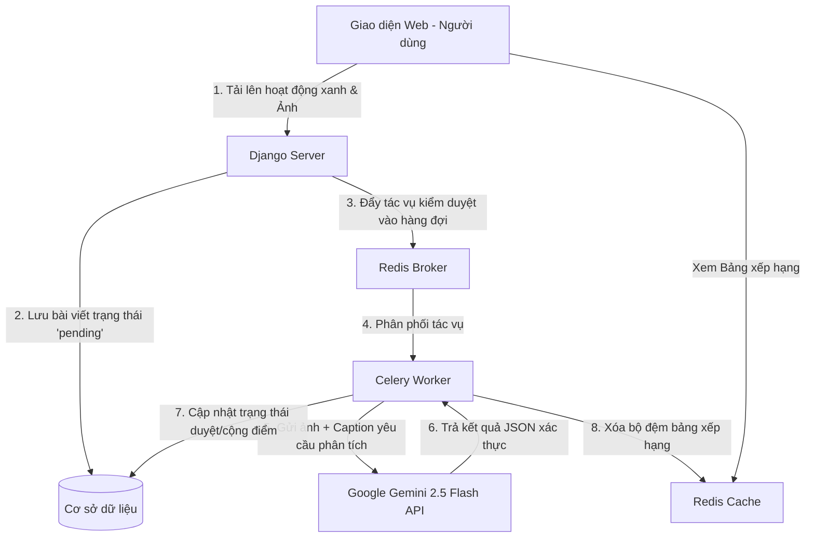
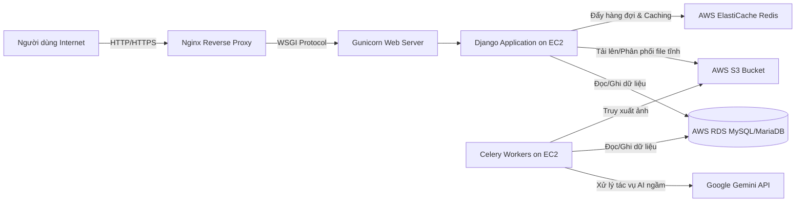

# HỌC VIỆN CÔNG NGHỆ SÁNG TẠO TEKY
## LẬP TRÌNH WEB DJANGO – PATHWAY

<br>
<br>
<center>
<h1>BÁO CÁO THỰC TẬP</h1>
<h2>Hành Trình Làm Thực Tập Sinh Dev/Web</h2>
<h3>Đề tài: Phát triển và Triển khai Nền tảng Mạng xã hội Sống xanh Eco Tracker</h3>
</center>
<br>
<br>

* **Giáo viên hướng dẫn (GVHD):** LÊ THANH NHÀN
* **Sinh viên thực hiện (SVTH):** TĂNG HOÀNG MINH HUY
* **Mã số học sinh (MSHS):** HCM-CH-002318
* **Lớp:** TE-C-PA-1518-2023LTWD-0015

<br>
<br>
<center>
<h4>TP. HỒ CHÍ MINH – NĂM 2026</h4>
</center>

---

## LỜI CẢM ƠN

Em xin gửi lời cảm ơn chân thành và sâu sắc đến thầy Nguyễn Minh Cường – người đã tận tình hướng dẫn, theo dõi và hỗ trợ em trong suốt quá trình thực tập tại vị trí Dev/Web. Sự tận tâm và thân thiện của thầy cô đã giúp em cảm thấy mình luôn được đồng hành và dẫn dắt đúng hướng, ngay cả khi gặp khó khăn hay bỡ ngỡ trong những ngày đầu thực tập.

Em cũng xin được gửi lời cảm ơn đặc biệt đến thầy Lê Thanh Nhàn – giáo viên chính phụ trách lớp học. Trong suốt quá trình làm việc cùng thầy, em đã học hỏi được rất nhiều từ phong cách giảng dạy linh hoạt, cách truyền đạt kiến thức một cách sinh động và gần gũi với học sinh, cũng như sự kiên nhẫn và tận tâm của thầy. Nhờ sự chỉ dẫn và hỗ trợ của thầy, em đã có thể hoàn thành tốt nhiệm vụ của mình.

Kì thực tập này không chỉ là một đợt thực tập, mà thực sự là một hành trình trải nghiệm và trưởng thành. Em đã có một mùa hè đáng nhớ – nơi em được học, được làm và được lớn lên trong chính môi trường đầy cảm hứng và nhân văn này.

Một lần nữa, em xin chân thành cảm ơn thầy Nguyễn Minh Cường và thầy Lê Thanh Nhàn đã tạo điều kiện tuyệt vời để em có được những trải nghiệm thực tế đầy ý nghĩa.

*TP. Hồ Chí Minh, Ngày 12 tháng 6 năm 2026*

**Học sinh thực hiện**

Tăng Hoàng Minh Huy

---

## NHẬN XÉT CỦA ĐƠN VỊ THỰC TẬP
*(Đánh giá tính xác thực về các dữ liệu, số liệu và mức độ đạt yêu cầu của báo cáo thực tập)*

- [ ] Xuất sắc
- [ ] Tốt
- [ ] Khá
- [ ] Đáp ứng yêu cầu
- [ ] Không đáp ứng yêu cầu

**Nhận xét thêm:**
................................................................................................................................................................................................................................................................................................................................................................................................................................................................................................
................................................................................................................................................................................................................................................................................................................................................................................................................................................................................................

<table width="100%">
  <tr>
    <td align="center" width="50%">
      <b>Giáo viên hướng dẫn</b><br>
      <i>(Ký, ghi rõ họ tên, đóng dấu)</i>
    </td>
    <td align="center" width="50%">
      <b>Đại diện đơn vị</b><br>
      <i>(Ký, ghi rõ họ tên, đóng dấu)</i>
    </td>
  </tr>
</table>

---

## MỤC LỤC

1. **LỜI CẢM ƠN** ................................................................................................................... 1
2. **NHẬN XÉT VÀ XÁC NHẬN CỦA ĐƠN VỊ THỰC TẬP** .............................................. 2
3. **LỜI MỞ ĐẦU** ..................................................................................................................... 4
4. **CHƯƠNG 1: TỔNG QUAN VỀ HỌC VIỆN CÔNG NGHỆ SÁNG TẠO TEKY** ............. 5
   * 1. Quá trình hình thành và phát triển của Học viện Sáng tạo Công nghệ TEKY ........... 5
   * 2. Sứ mệnh và Tầm nhìn .................................................................................................. 7
   * *Tổng kết Chương 1* ........................................................................................................ 8
5. **CHƯƠNG 2: HÀNH TRÌNH THỰC TẬP VÀ PHÁT TRIỂN DỰ ÁN ECO TRACKER** ... 9
   * *Phần 1: Kiến thức và kỹ năng được học* ........................................................................ 9
   * *Phần 2: Dự án Eco Tracker (Kiến trúc, Cơ sở dữ liệu và Chức năng)* ........................... 11
   * *Phần 3: Triển khai ứng dụng trên hạ tầng điện toán đám mây AWS* ............................. 19
   * *Tổng kết Chương 2* ........................................................................................................ 23
6. **KẾT LUẬN** ........................................................................................................................ 24
7. **TÀI LIỆU THAM KHẢO** .................................................................................................. 25

---

## LỜI MỞ ĐẦU

Trong bối cảnh công nghệ thông tin phát triển mạnh mẽ và quá trình chuyển đổi số đang diễn ra trên nhiều lĩnh vực, nhu cầu về các sản phẩm và dịch vụ công nghệ ngày càng gia tăng. Đặc biệt, phát triển website và các nền tảng trực tuyến đã trở thành một phần quan trọng trong hoạt động của doanh nghiệp, góp phần nâng cao hiệu quả quản lý, quảng bá thương hiệu và cải thiện trải nghiệm người dùng. Vì vậy, việc trang bị kiến thức chuyên môn cũng như tiếp cận với môi trường làm việc thực tế là yêu cầu cần thiết đối với sinh viên ngành Công nghệ thông tin.

Thực tập doanh nghiệp là cơ hội để sinh viên vận dụng những kiến thức đã học vào thực tiễn, đồng thời học hỏi thêm kinh nghiệm làm việc, kỹ năng chuyên môn và tác phong nghề nghiệp. Trong thời gian thực tập tại Công ty Cổ phần Công nghệ và Sáng tạo Trẻ (Teky) thuộc chương trình Lập trình Web Django - Pathway, em đã có cơ hội tìm hiểu về môi trường làm việc chuyên nghiệp, tham gia vào các công việc liên quan đến phát triển web và trực tiếp tiếp cận với những công nghệ, công cụ được sử dụng trong thực tế.

Báo cáo thực tập này được thực hiện nhằm tổng kết những kiến thức, kỹ năng và kinh nghiệm mà em đã tích lũy được trong quá trình thực tập tại công ty. Nội dung báo cáo tập trung trình bày quá trình học tập công nghệ mới, thiết kế kiến trúc hệ thống, chi tiết cơ sở dữ liệu và quy trình phát triển sản phẩm Mạng xã hội sống xanh Eco Tracker – một ứng dụng tích hợp Trí tuệ nhân tạo (AI) và cơ chế Gamification (Trò chơi hóa) để thúc đẩy lối sống bền vững. Thông qua đó, em có cơ hội đánh giá lại năng lực bản thân, đồng thời định hướng rõ hơn cho quá trình học tập và phát triển nghề nghiệp trong tương lai.

---

## CHƯƠNG 1: TỔNG QUAN VỀ HỌC VIỆN CÔNG NGHỆ SÁNG TẠO TEKY

### 1. Quá trình hình thành và phát triển của Học viện Sáng tạo Công nghệ TEKY

#### 1.1 Quá trình hình thành
Học viện Sáng tạo Công nghệ Teky được thành lập vào tháng 6/2016, với tầm nhìn tiên phong mang giáo dục STEAM (Khoa học – Công nghệ – Kỹ thuật – Nghệ thuật – Toán học) chuẩn Mỹ đến Việt Nam, dành cho trẻ em từ 4 đến 18 tuổi. Dưới đây là hành trình hình thành và những cột mốc quan trọng của Teky:
* Teky chính thức ra đời vào tháng 6/2016, trở thành học viện đầu tiên tại Việt Nam áp dụng phương pháp giáo dục STEAM chuẩn Mỹ.
* Tập trung vào các bộ môn công nghệ tiên tiến như Lập trình và Phát triển ứng dụng, Robotics Engineering, Công nghệ 3D, và Truyền thông đa phương tiện.
* Xây dựng nền tảng học tập kết hợp Online và Offline, sử dụng hệ thống LMS tích hợp A.I để cá nhân hóa lộ trình học, cùng đội ngũ giáo viên giàu kinh nghiệm, tận tâm.

#### 1.2 Sự phát triển và thành tựu
* **Tháng 11/2016:** Chỉ 5 tháng sau khi thành lập, học viện Teky giành 5 huy chương bạc tại cuộc thi lập trình quốc tế WeCode (bộ môn Scratch, độ tuổi 6-9), khẳng định chất lượng đào tạo vượt trội.
* **Tháng 3/2017:** Được Chính phủ Úc bình chọn là 1 trong 10 dự án Ảnh hưởng Xã hội hàng đầu Đông Nam Á, và là dự án duy nhất của Việt Nam trong số 2.000 dự án được sàng lọc.
* **Tháng 6/2017:** Lọt top 3 dự án xuất sắc tại sự kiện Women NextGen Entrepreneur tại Thụy Sĩ, ghi dấu ấn trên trường quốc tế.
* **Tháng 9/2017:** Triển khai chương trình Hour of Code, tiếp cận hơn 3.000 học sinh trên toàn quốc, truyền cảm hứng học công nghệ.
* **2017-2019:** Nhận 5 giải thưởng Rice Bowl Startup Award bao gồm: *Dự án đào tạo có ảnh hưởng xã hội tốt nhất (2017)*, *Khởi nghiệp được bình chọn nhiều nhất & Dự án cống hiến cho xã hội tốt nhất (2018)*, *Founder Of The Year & Best NewComer (2019)*.
* **2019:** Vinh danh tại Giải thưởng Doanh nghiệp Đông Nam Á (ABA). Founder Đào Lan Hương nhận giải Doanh nghiệp khởi nghiệp và đổi mới sáng tạo xuất sắc tại ASEAN BIS. Ông Lê Quang Tuấn được vinh danh Nhà lãnh đạo Giáo dục công nghệ Xuất sắc nhất Châu Á tại Singapore.
* **Tháng 12/2019:** Teky được Diễn đàn Kinh tế Thế giới (WEF) công nhận là mô hình giáo dục toàn cầu tiêu biểu tại Davos, Thụy Sĩ, khẳng định vị thế trên trường quốc tế.
* **2020:** Nhận Giải thưởng Quốc tế Stevie Awards nhờ những nỗ lực thúc đẩy công nghệ và kinh doanh giáo dục; lọt vào vòng đề cử Giải thưởng Startup Toàn cầu (Global Startup Awards).
* **2023 - 2025:** Nhận giải thưởng Công nghệ Giáo dục tiêu biểu EdTech Awards 2023 và lọt Top 50 EdTech Đông Nam Á trong 3 năm liên tiếp (2023, 2024, 2025) do tổ chức HolonIQ xếp hạng.

---

### 2. Sứ mệnh và Tầm nhìn

#### 2.1 Sứ mệnh của Teky
* **Nuôi dưỡng thế hệ tương lai:** Tại TEKY, mục tiêu hàng đầu là nuôi dưỡng một thế hệ trẻ Việt Nam bản lĩnh, sáng tạo và làm chủ công nghệ trong kỷ nguyên số.
* **Trang bị kỹ năng toàn diện:** Với môi trường đào tạo hiện đại và nền tảng STEAM vững chắc, TEKY trang bị cho học sinh tư duy máy tính, tư duy thiết kế và kỹ năng giải quyết vấn đề, chuẩn bị sẵn sàng cho cách mạng công nghiệp 4.0.
* **Đóng góp xã hội:** Cam kết lan tỏa giáo dục STEAM tới cộng đồng, nâng tầm chất lượng học tập tại Việt Nam và khu vực Đông Nam Á, không ngừng đổi mới hệ sinh thái giáo dục bắt kịp xu hướng toàn cầu.
* **Truyền cảm hứng sáng tạo:** Là nơi khơi dậy đam mê, đánh thức tiềm năng để các em tự tin bước ra thế giới, trở thành doanh nhân công nghệ và công dân toàn cầu.

#### 2.2 Tầm nhìn trong tương lai
TEKY hướng tới việc xây dựng một nền giáo dục công nghệ hiện đại, nơi thế hệ trẻ được phát triển toàn diện, có tư duy số sắc bén và làm chủ công nghệ, đóng vai trò tiên phong trong nền kinh tế số của Việt Nam và toàn cầu trong tương lai.

---

### Tổng Kết Chương 1
Học viện Teky là nơi khởi nguồn cho đam mê công nghệ của các bạn nhỏ từ 5 đến 18 tuổi, nơi các em được tiếp cận với mô hình giáo dục STEAM chuẩn Mỹ trong môi trường sáng tạo và hiện đại. Sự kết hợp giữa chương trình đào tạo chuẩn quốc tế, nền tảng công nghệ tiên tiến cùng đội ngũ giáo viên tận tâm đã tạo nên một hành trình học tập lý tưởng. TEKY không chỉ truyền đạt kiến thức kỹ thuật mà còn rèn luyện các kỹ năng mềm quan trọng, giúp học sinh sẵn sàng thích nghi và dẫn đầu trong tương lai số.

---

## CHƯƠNG 2: HÀNH TRÌNH THỰC TẬP VÀ PHÁT TRIỂN DỰ ÁN ECO TRACKER

### Phần 1: Kiến thức và kỹ năng được học

Trong suốt quá trình thực tập tại vị trí Dev/Web thuộc lộ trình Django Pathway, em đã được đào tạo bài bản và tự học để làm chủ các kiến thức nền tảng và nâng cao liên quan đến phát triển phần mềm, cụ thể như sau:

#### 1. Lập trình Backend với Django Framework (Python)
* **Cơ cấu Model-View-Template (MVT):** Hiểu rõ luồng xử lý yêu cầu (HTTP Request/Response) trong Django, phân tách rõ ràng giữa logic nghiệp vụ (Views), cấu trúc dữ liệu (Models) và giao diện kết xuất (Templates).
* **Django ORM (Object-Relational Mapping):** Sử dụng các truy vấn ORM thay cho SQL thuần để thao tác với cơ sở dữ liệu một cách an toàn (tránh lỗi SQL Injection). Sử dụng thành thạo các phương thức nâng cao như `select_related()` và `prefetch_related()` để giải quyết triệt để vấn đề truy vấn thừa $N+1$ dư thừa dữ liệu.
* **Authentication & Authorization:** Triển khai hệ thống phân quyền, đăng nhập, đăng ký và bảo mật tài khoản bằng các công cụ tích hợp sẵn của Django.
* **Signals & Middleware:** Sử dụng Signals (ví dụ: bắt tín hiệu `post_save` trên Model `User` để tự động tạo `UserProfile`) và viết Context Processors để truyền các thông tin toàn cục vào các giao diện HTML.

#### 2. Xử lý tác vụ bất đồng bộ (Asynchronous Tasks) với Celery và Redis
* **Xử lý tắc nghẽn hệ thống:** Hiểu rõ hạn chế của mô hình đồng bộ (Synchronous) khi gọi các API bên ngoài hoặc xử lý ảnh nặng (khiến luồng chính bị treo).
* **Kiến trúc Message Broker:** Học cách cấu hình Redis làm hàng đợi thông điệp (Broker) kết nối giữa Django và hệ thống tiến trình chạy ngầm Celery Worker để xử lý tác vụ bất đồng bộ (`shared_task`).

#### 3. Tích hợp Trí tuệ Nhân tạo (AI Integration)
* **Sử dụng Gemini API:** Tích hợp mô hình ngôn ngữ lớn **Google Gemini 2.5 Flash** để thực hiện phân tích và nhận diện hình ảnh hoạt động sống xanh trong thời gian thực.
* **Xử lý dữ liệu đa phương tiện:** Mã hóa hình ảnh sang định dạng Base64 và truyền dữ liệu JSON qua giao thức HTTP REST API bằng thư viện `httpx` trong Python.

#### 4. Kỹ thuật Caching
* Sử dụng Redis làm bộ nhớ đệm (Caching) cho các chức năng yêu cầu hiệu năng cao như bảng xếp hạng (Leaderboards), giảm số lượng truy vấn phức tạp (như `Sum`, `Count`) xuống cơ sở dữ liệu và thiết lập cơ chế giải phóng bộ đệm (Cache Invalidation) thông minh.

#### 5. Triển khai Hệ thống và DevOps (Cloud Computing)
* Cấu hình và làm việc trên môi trường Linux (Ubuntu Server).
* Sử dụng AWS EC2 cho Web Server, AWS RDS (MySQL/PostgreSQL) cho Database và AWS S3 cho lưu trữ tệp tin tĩnh/đa phương tiện.
* Quản lý tiến trình chạy ngầm bằng Supervisor và cấu hình Reverse Proxy bằng Nginx phối hợp cùng Gunicorn WSGI.

---

### Phần 2: Dự án Eco Tracker (Kiến trúc, Cơ sở dữ liệu và Chức năng)

#### 1. Giới thiệu dự án Eco Tracker
Eco Tracker là nền tảng mạng xã hội kết hợp trò chơi hóa (Gamification) và Trí tuệ nhân tạo (AI) nhằm khuyến khích người dùng xây dựng thói quen sống xanh một cách bền vũg. Ứng dụng biến mỗi hành động bảo vệ môi trường thực tế (như tái chế, trồng cây, tiết kiệm điện...) thành những thử thách có điểm thưởng, cấp độ, huy hiệu và bảng xếp hạng thi đua lành mạnh trong cộng đồng.

#### 2. Kiến trúc hệ thống
Eco Tracker được xây dựng theo mô hình kiến trúc MVC (Model-View-Controller) của Django kết hợp xử lý bất đồng bộ ngầm qua Celery và Redis.



#### 3. Chi tiết Cơ sở dữ liệu (Database Schema)
Hệ thống sử dụng cơ sở dữ liệu quan hệ gồm 21 bảng (Models) được tối ưu hóa chỉ mục (`db_index=True`) trên các trường tìm kiếm chính để đảm bảo hiệu năng tối ưu:

| STT | Tên Model | Ý nghĩa & Mô tả chức năng |
| :--- | :--- | :--- |
| 1 | `User` | Bảng quản lý tài khoản người dùng mặc định của Django (username, email, password, etc.). |
| 2 | `UserProfile` | Hồ sơ chi tiết liên kết 1-1 với `User`. Lưu trữ: ảnh đại diện (`avatar`), chuỗi ngày hoạt động (`streak_count`), ngày hoạt động cuối cùng (`last_action_date`), cấp độ cuối cùng (`last_level`), khung avatar đang hoạt động (`active_frame`). |
| 3 | `EcoAction` | Lưu trữ hoạt động sống xanh tải lên của người dùng. Gồm ảnh hoạt động (`image`), mô tả (`caption`), phân loại (`category`), điểm số nhận được (`points`), trạng thái duyệt AI (`ai_status`), lý do AI phản hồi (`ai_reason`), thời gian tạo (`created_at`). |
| 4 | `Friendship` | Quản lý mối quan hệ bạn bè giữa hai tài khoản (`sender` và `receiver`) với các trạng thái `pending` và `accepted`. |
| 5 | `EcoGroup` | Quản lý các nhóm sống xanh do người dùng thành lập, gồm tên nhóm, chủ nhóm (`owner`) và danh sách các thành viên nhóm. |
| 6 | `GroupMember` | Bảng trung gian liên kết nhiều - nhiều giữa `EcoGroup` và `User`, lưu trữ ngày tham gia nhóm (`joined_at`). |
| 7 | `Badge` | Định nghĩa các huy hiệu danh giá, gồm mã huy hiệu (`code`), tên (`name`), mô tả (`description`), emoji biểu tượng (`icon`), danh mục yêu cầu (`requirement_category`), số lượng yêu cầu (`requirement_count`). |
| 8 | `UserBadge` | Lưu trữ các huy hiệu mà từng người dùng đã tích lũy thành công. |
| 9 | `EcoActionLike` | Lưu trữ các tương tác thích bài viết. Hỗ trợ 4 loại phản ứng sống xanh khác nhau: 💚, ♻️, 🌳, ⚡ (`reaction_type`). |
| 10 | `GroupWeeklyQuest` | Nhiệm vụ tuần của nhóm, gồm danh mục hoạt động mục tiêu, số lượng mục tiêu (`target_count`), ngày bắt đầu và trạng thái hoàn thành (`is_completed`). |
| 11 | `GroupInvite` | Lời mời tham gia nhóm sống xanh giữa người gửi (`sender`), người nhận (`receiver`) và nhóm (`group`). |
| 12 | `DailyMission` | Định nghĩa các nhiệm vụ hàng ngày (ví dụ: "Sử dụng phương tiện công cộng", "Tái chế chai nhựa"). |
| 13 | `UserDailyMission` | Theo dõi tiến trình nhiệm vụ ngày của từng người dùng cụ thể vào một ngày xác định. |
| 14 | `WeeklyMission` | Định nghĩa các nhiệm vụ hàng tuần. |
| 15 | `UserWeeklyMission` | Theo dõi tiến trình và số lượng hoạt động đạt được của người dùng đối với nhiệm vụ tuần. |
| 16 | `AvatarFrame` | Định nghĩa các khung viền Avatar trong cửa hàng, gồm tên, giá điểm (`cost`), mã CSS tùy biến để tạo hiệu ứng phát sáng/động (`css_style`) và emoji xem trước (`preview_emoji`). |
| 17 | `UserAvatarFrame` | Lưu trữ thông tin sở hữu khung avatar của người dùng sau khi mua thành công từ cửa hàng. |
| 18 | `UserGroupQuestReward` | Ghi nhận phần thưởng điểm co-op cho từng thành viên khi nhóm của họ hoàn thành nhiệm vụ tuần của nhóm. |
| 19 | `TriviaQuestion` | Lưu trữ ngân hàng câu hỏi trắc nghiệm kiến thức môi trường (Trivia Quiz) gồm câu hỏi, 4 đáp án A, B, C, D, đáp án đúng và phần giải thích chi tiết. |
| 20 | `UserTriviaSubmission` | Ghi nhận lượt làm trắc nghiệm hàng ngày của người dùng, số câu trả lời đúng và điểm số đạt được. |
| 21 | `AICoachSuggestion` | Lưu trữ các gợi ý sống xanh cá nhân hóa được tạo bởi AI Eco Coach cho người dùng dựa trên hành vi hoạt động của họ. |

#### 4. Các tính năng chính và chi tiết kỹ thuật

##### 4.1. Đăng ký & Đăng nhập (Authentication)
Sử dụng hệ thống xác thực mặc định của Django, mở rộng thông qua signals để tự động tạo `UserProfile` tương ứng khi một người dùng mới đăng ký thành công.
* Mật khẩu được mã hóa an toàn bằng thuật toán PBKDF2 mặc định của Django.
* Giao diện cung cấp đầy đủ chức năng đăng nhập, đăng ký, chỉnh sửa hồ sơ cá nhân và thay đổi ảnh đại diện.

##### 4.2. Eco Feed & Tương tác xã hội
* **Đăng bài viết:** Người dùng tải lên các hoạt động sống xanh kèm hình ảnh thực tế và viết mô tả.
* **Tương tác động:** Thay vì nút Thích (Like) thông thường, Eco Tracker thiết kế 4 loại phản ứng mang đậm tính chất môi trường:
  * 💚: Trân trọng / Yêu thích hành động sống xanh.
  * ♻️: Cổ vũ hoạt động tái chế.
  * 🌳: Đồng lòng trồng cây, bảo vệ rừng.
  * ⚡: Khuyến khích tiết kiệm năng lượng.
* **Bình luận:** Cho phép thảo luận dưới mỗi bài đăng để tạo dựng cộng đồng sống xanh kết nối chặt chẽ.

##### 4.3. Xác minh hình ảnh tự động bằng AI (AI Image Verification)
Khi người dùng đăng tải một hoạt động mới kèm hình ảnh, hệ thống không duyệt trực tiếp mà chuyển sang trạng thái chờ kiểm duyệt (`ai_status="pending"`). Một tác vụ ngầm chạy bất đồng bộ được đẩy vào Celery Task Queue:
1. `classify_eco_action_task(action_id)` được gọi.
2. Hệ thống chuyển đổi hình ảnh thành mã Base64 và gửi yêu cầu đến **Google Gemini 2.5 Flash API** kèm theo nội dung mô tả của người dùng.
3. AI tiến hành phân tích bức ảnh và kiểm chứng xem có đúng là hành động bảo vệ môi trường hay không, đồng thời phân loại vào 1 trong 6 danh mục xanh:
   * `recycling` (tái chế rác thải nhựa, giấy, kim loại...).
   * `tree_planting` (trồng cây, tưới cây, làm vườn...).
   * `green_transport` (đi bộ, đi xe đạp, sử dụng xe buýt, tàu điện...).
   * `clean_up` (thu gom rác thải, dọn dẹp không gian chung...).
   * `saving_energy` (tắt bớt thiết bị điện, tiết kiệm nước...).
   * `reusable_item` (sử dụng túi vải, bình nước cá nhân...).
4. Trả về kết quả JSON dạng cấu trúc chuẩn:
   ```json
   {
       "category": "recycling",
       "confidence": 0.95,
       "reason": "The image shows sorted plastic bottles in a recycling bin, aligning with the caption.",
       "is_eco_action": true
   }
   ```
5. Nếu AI xác nhận là hành động xanh hợp lệ (`is_eco_action: true`), bài viết sẽ được chuyển trạng thái sang `approved`, đồng thời kích hoạt các nghiệp vụ cộng điểm, tăng streak, và tính tiến trình nhiệm vụ.
6. Nếu hình ảnh không hợp lệ (ví dụ: ảnh selfie, ảnh phong cảnh không liên quan, ảnh tải từ internet không đúng mô tả), AI sẽ đánh dấu `rejected` kèm lý do cụ thể hiển thị trực quan lên giao diện người dùng.
7. **Cơ chế dự phòng (Fallback):** Trong trường hợp API Gemini gặp sự cố mạng hoặc quá tải, hệ thống tự động kích hoạt bộ lọc từ khóa thông minh (Smart Keyword Classifier) dựa trên phân tích chuỗi văn bản và tên tệp ảnh để phân loại, đảm bảo tính liên tục của hệ thống.

##### 4.4. Hệ thống Trò chơi hóa (Gamification)
Đây là hạt nhân cốt lõi nhằm tăng cường động lực sử dụng ứng dụng thường xuyên của người dùng:
* **Hệ thống cấp độ:** Gồm 10 cấp độ sống xanh từ *Eco Novice (Tân Binh)* đến *Earth Guardian (Hộ vệ Trái đất)* dựa trên điểm tích lũy:

| Cấp độ | Danh hiệu | Điểm tối thiểu | Điểm tối đa | Biểu tượng |
| :--- | :--- | :--- | :--- | :--- |
| 1 | Eco Novice | 0 | 100 | 🌱 |
| 2 | Green Starter | 100 | 250 | 🍃 |
| 3 | Eco Activist | 250 | 500 | 🌿 |
| 4 | Sustainability Seeker | 500 | 800 | 🍀 |
| 5 | Waste Warrior | 800 | 1200 | 🧹 |
| 6 | Planet Protector | 1200 | 1800 | 🌍 |
| 7 | Forest Guardian | 1800 | 2500 | 🌳 |
| 8 | Energy Innovator | 2500 | 3500 | ⚡ |
| 9 | Climate Champion | 3500 | 5000 | 🏆 |
| 10 | Earth Guardian | 5000 | Không giới hạn | 🛡️ |

* **Hệ thống Streak và Hệ số Nhân điểm:**
  * Để khuyến khích thói quen sống xanh hàng ngày, hệ thống ghi nhận tần suất đăng bài của người dùng.
  * Nếu người dùng duy trì streak từ 3 - 6 ngày liên tục, họ sẽ nhận được hệ số nhân điểm **1.1x** cho các hoạt động tiếp theo.
  * Nếu duy trì streak từ 7 ngày trở lên, hệ số nhân điểm sẽ tăng lên **1.3x**.
* **Daily Points Cap (Giới hạn điểm ngày):** Nhằm ngăn chặn hành vi gian lận (spam đăng bài để lấy điểm ảo), hệ thống áp dụng giới hạn điểm nhận được tối đa mỗi ngày là **100 điểm** (cấu hình trong `settings.py`).
* **Nhiệm vụ Ngày và Nhiệm vụ Tuần:**
  * Mỗi ngày người dùng nhận các thử thách ngẫu nhiên từ hệ thống. Khi hoàn thành toàn bộ nhiệm vụ ngày sẽ nhận được điểm thưởng bổ sung ("Perfect Day").
  * Nhiệm vụ tuần yêu cầu số lượng tích lũy lớn hơn (ví dụ: thực hiện 5 hoạt động tái chế trong tuần).
* **Avatar Frame Shop (Cửa hàng khung viền):** Điểm số xanh (Eco Points) tích lũy được có thể dùng để mua các khung viền Avatar đặc biệt. Khung viền sau khi kích hoạt sẽ hiển thị bao quanh ảnh đại diện của người dùng trên Eco Feed và Bảng xếp hạng. Sử dụng CSS tùy biến cao cấp để tạo hiệu ứng phát sáng (glow), màu sắc chuyển động chuyển màu (gradient neon, galaxy).
* **Trivia Quiz (Trắc nghiệm bảo vệ môi trường):** Mỗi ngày người dùng có thể tham gia trả lời nhanh 3 câu hỏi trắc nghiệm về kiến thức biến đổi khí hậu và bảo vệ môi trường để nhận thêm điểm thưởng.

##### 4.5. Bảng xếp hạng (Leaderboard) & Tối ưu bộ đệm (Caching)
Bảng xếp hạng hiển thị thứ tự thi đua của tất cả người dùng dựa trên tổng điểm số. Chức năng này thực hiện rất nhiều truy vấn tính toán nặng (`Sum`, `Count`) trên toàn bộ cơ sở dữ liệu.
* **Giải pháp tối ưu:** Kết quả truy vấn bảng xếp hạng được lưu trữ vào bộ nhớ đệm Redis Cache (`leaderboard_data`) với thời gian hết hạn là 10 phút.
* **Cơ chế Cache Invalidation:** Nhằm duy trì tính chính xác thời gian thực, bất cứ khi nào có thao tác thay đổi điểm số của bất kỳ người dùng nào (khi AI duyệt bài thành công, người dùng làm trắc nghiệm đúng, hoàn thành nhiệm vụ...), hệ thống sẽ chủ động xóa khóa cache `leaderboard_data` (`cache.delete("leaderboard_data")`). Lần tải trang tiếp theo sẽ lấy dữ liệu mới và ghi lại vào bộ đệm, giúp tăng tốc độ phản hồi trang web xuống còn $O(1)$.

##### 4.6. Trợ lý ảo AI Eco Coach
* Tích hợp AI đóng vai trò làm huấn luyện viên môi trường cho từng cá nhân.
* AI sẽ quét và phân tích hành vi, thống kê các hoạt động sống xanh trong tuần của người dùng (Ví dụ: người dùng đăng nhiều hoạt động tái chế nhưng chưa có hoạt động tiết kiệm năng lượng).
* Từ đó, AI Eco Coach đưa ra những lời khuyên sâu sắc, đề xuất các thử thách tuần mới nhằm cân bằng lối sống thân thiện với môi trường một cách cá nhân hóa.

---

### Phần 3: Triển khai ứng dụng trên hạ tầng điện toán đám mây AWS

Để chuyển đổi ứng dụng từ môi trường phát triển cục bộ (Local Development) lên môi trường sản xuất chạy thực tế ổn định, hệ thống đã được triển khai lên nền tảng điện toán đám mây **Amazon Web Services (AWS)** với mô hình kiến trúc phân lớp bảo mật như sau:

#### 1. Sơ đồ kiến trúc triển khai trên AWS



#### 2. Thiết lập cơ sở dữ liệu trên AWS RDS MySQL
Thay vì chạy cơ sở dữ liệu SQLite cục bộ không đảm bảo an toàn dữ liệu, hệ thống sử dụng dịch vụ cơ sở dữ liệu đám mây **AWS RDS** chạy MySQL/MariaDB để đảm bảo hiệu năng và sao lưu tự động.
* Cài đặt thư viện kết nối cơ sở dữ liệu trong môi trường ảo:
  ```bash
  pip install pymysql
  ```
* Khởi tạo kết nối trong tệp tin `eco_tracker/config/settings.py` bằng cách cấu hình biến `DATABASES` kết nối trực tiếp đến RDS Endpoint:
  ```python
  DATABASES = {
      "default": {
          "ENGINE": "django.db.backends.mysql",
          "NAME": "ecotracker",
          "USER": "admin",
          "PASSWORD": "isb-mysql-db-password",
          "HOST": "isb-mysql-db.cfmqo2ccy3py.ap-southeast-1.rds.amazonaws.com",
          "PORT": "3306",
      }
  }
  ```

#### 3. Lưu trữ tệp tin tĩnh và tệp phương tiện tải lên qua AWS S3
Để giảm tải cho máy chủ EC2 và đảm bảo dữ liệu hình ảnh của người dùng không bị mất khi máy chủ EC2 khởi động lại, toàn bộ tệp tĩnh (CSS, JS) và tệp tin đa phương tiện (Ảnh avatar, ảnh hoạt động xanh) được lưu trữ tập trung trên dịch vụ lưu trữ đám mây **AWS S3**.
* Cài đặt thư viện hỗ trợ lưu trữ đám mây:
  ```bash
  pip install django-storages boto3
  ```
* Cấu hình liên kết S3 trong tệp tin `settings.py`:
  ```python
  USE_S3 = os.environ.get("USE_S3", "True") == "True"

  if USE_S3:
      AWS_ACCESS_KEY_ID = os.environ.get("AWS_ACCESS_KEY_ID")
      AWS_SECRET_ACCESS_KEY = os.environ.get("AWS_SECRET_ACCESS_KEY")
      AWS_STORAGE_BUCKET_NAME = os.environ.get("AWS_STORAGE_BUCKET_NAME", "ecotracker-media1")
      AWS_S3_REGION_NAME = os.environ.get("AWS_S3_REGION_NAME", "us-east-1")
      
      AWS_S3_CUSTOM_DOMAIN = f"{AWS_STORAGE_BUCKET_NAME}.s3.amazonaws.com"
      AWS_S3_FILE_OVERWRITE = False
      AWS_DEFAULT_ACL = None
      AWS_QUERYSTRING_AUTH = False

      STORAGES = {
          "default": {
              "BACKEND": "tracker.storage_backends.MediaStorage",
          },
          "staticfiles": {
              "BACKEND": "django.contrib.staticfiles.storage.StaticFilesStorage",
          },
      }
      MEDIA_URL = f"https://{AWS_S3_CUSTOM_DOMAIN}/media/"
  ```

#### 4. Quản lý tiến trình Celery Worker bằng Supervisor trên EC2
Để đảm bảo hàng đợi xử lý ảnh AI chạy ổn định liên tục 24/7 và tự động khởi động lại nếu tiến trình gặp lỗi hoặc bộ nhớ bị tràn, chương trình **Supervisor** được cài đặt trên Ubuntu Server để giám sát tiến trình Celery.
* Cấu hình tệp tin quản lý tiến trình Celery `/etc/supervisor/conf.d/ecotracker-celery.conf`:
  ```ini
  [program:ecotracker-celery]
  command=/home/ubuntu/ECOTRACKER-main/.venv/bin/celery -A config worker --loglevel=info
  directory=/home/ubuntu/ECOTRACKER-main/eco_tracker
  user=ubuntu
  numprocs=1
  stdout_logfile=/home/ubuntu/ECOTRACKER-main/logs/celery.log
  stderr_logfile=/home/ubuntu/ECOTRACKER-main/logs/celery_err.log
  autostart=true
  autorestart=true
  startsecs=10
  ```
* Lệnh quản lý Supervisor:
  ```bash
  sudo supervisorctl reread
  sudo supervisorctl update
  sudo supervisorctl start ecotracker-celery
  ```

#### 5. Thiết lập Nginx và Gunicorn trên EC2
* **Gunicorn (Green Unicorn):** Đóng vai trò là WSGI HTTP Server để thực thi mã nguồn Python/Django.
  Cấu hình Supervisor giám sát Gunicorn (`/etc/supervisor/conf.d/ecotracker-gunicorn.conf`) chạy trên cổng nội bộ `8000`.
* **Nginx:** Đóng vai trò là Reverse Proxy nằm ở lớp ngoài cùng tiếp nhận các yêu cầu HTTP/HTTPS của người dùng từ internet (cổng 80/443), sau đó chuyển tiếp yêu cầu đến Gunicorn thông qua địa chỉ `http://127.0.0.1:8000/`. Nginx giúp tăng tốc độ tải trang nhờ cơ chế nén dữ liệu và nâng cao bảo mật hệ thống.

---

### Tổng Kết Chương 2
Qua quá trình học tập và trực tiếp phát triển ứng dụng Eco Tracker, em đã nắm vững quy trình phát triển sản phẩm phần mềm hoàn chỉnh theo mô hình Django hiện đại. Em đã áp dụng thành công các kiến thức đã học vào dự án thực tế bao gồm thiết kế cơ sở dữ liệu quan hệ chặt chẽ với hơn 20 bảng, tối ưu hóa hiệu năng bằng các kỹ thuật Caching Redis và loại bỏ N+1 Queries, tích hợp API Google Gemini 2.5 Flash để tự động kiểm duyệt hình ảnh và xử lý bất đồng bộ qua hệ thống hàng đợi Celery + Redis. Cuối cùng, việc triển khai thành công ứng dụng lên hạ tầng AWS (EC2, S3, RDS) giúp em hiểu rõ hơn vai trò của một lập trình viên Dev/Web trong môi trường doanh nghiệp thực tế.

---

## KẾT LUẬN

Báo cáo thực tập với đề tài “Hành trình làm thực tập sinh Dev/Web – Phát triển và Triển khai Nền tảng Mạng xã hội Sống xanh Eco Tracker” đã ghi lại chi tiết quá trình em học tập công nghệ, nghiên cứu kiến trúc hệ thống và trực tiếp phát triển, triển khai sản phẩm thực tế trong thời gian thực tập.

Thông qua quá trình thực tập, em đã có cơ hội vận dụng những kiến thức đã học vào thực tế, đồng thời nâng cao kỹ năng giải quyết vấn đề và khả năng thích nghi với môi trường làm việc chuyên nghiệp. Bên cạnh đó, em cũng hiểu rõ hơn về quy trình phát triển sản phẩm phần mềm, tác phong làm việc trong doanh nghiệp và trách nhiệm của một lập trình viên trong quá trình xây dựng và phát triển sản phẩm.

Bên cạnh những kiến thức và kinh nghiệm đã tích lũy được, em nhận thấy bản thân vẫn cần tiếp tục học hỏi và hoàn thiện nhiều kỹ năng chuyên môn như phát triển nâng cao các APIs bảo mật, thiết kế và quản lý cơ sở dữ liệu lớn, tối ưu hiệu năng sâu hơn cho các tác vụ Celery phức tạp cũng như nâng cao khả năng làm việc với các công cụ CI/CD để tự động hóa quy trình triển khai phần mềm. Trong các kỳ học tiếp theo, em mong muốn được tiếp cận nhiều hơn với các dự án thực tế quy mô lớn, tìm hiểu sâu hơn về quy trình kiểm thử hệ thống và các công nghệ điện toán đám mây tiên tiến.

Đợt thực tập tại Học viện Sáng tạo Công nghệ TEKY là một trải nghiệm quý báu, giúp em tích lũy thêm kiến thức chuyên môn, kinh nghiệm thực tế và định hướng rõ ràng hơn cho con đường nghề nghiệp trong lĩnh vực phát triển phần mềm trong tương lai.

---

## TÀI LIỆU THAM KHẢO

1. **Trang web học viện công nghệ sáng tạo TEKY:**
   * Truy cập Trang chủ: [https://teky.edu.vn](https://teky.edu.vn)
2. **Tài liệu hướng dẫn phát triển Django Framework:**
   * Hướng dẫn chính thức (Official Django Documentation): [https://docs.djangoproject.com/en/5.0/](https://docs.djangoproject.com/en/5.0/)
3. **Tài liệu tích hợp Celery và Redis trong ứng dụng Django:**
   * Hướng dẫn cấu hình Celery (Celery Official Documentation): [https://docs.celeryq.dev/en/stable/](https://docs.celeryq.dev/en/stable/)
4. **Tài liệu hướng dẫn sử dụng Google Gemini API:**
   * Google AI Studio Developers Documentation: [https://ai.google.dev/gemini-api/docs](https://ai.google.dev/gemini-api/docs)
5. **Tài liệu hướng dẫn triển khai trên hạ tầng đám mây AWS:**
   * AWS Developer Guide & Documentation (EC2, S3, RDS): [https://docs.aws.amazon.com/](https://docs.aws.amazon.com/)
6. **Mã nguồn dự án Eco Tracker:**
   * Kho lưu trữ mã nguồn và triển khai cục bộ dự án Eco Tracker.
